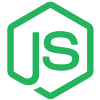

### 👋 Hello World!

🌐 Welcome to my GitHub! I’m dedicated to exploring new technology and value continuous learning and collaboration. I look forward to connecting with like-minded individuals and contributing to innovative projects.

👀 My interests include Full Stack Web Development, Cybersecurity, Game Development, Machine Learning/AI, and UI/UX Design.

🌱 I’m currently diving deeper into React and GraphQL, expanding my toolkit for building dynamic, data-driven applications.

### Languages and Tools:
  
 
    
     
     
    
     
     
    
    
    
    
    
    
    
    
    
    
    
  

  
